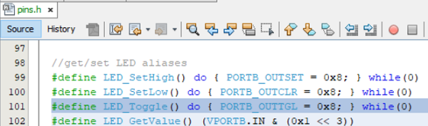

<!-- Please do not change this logo with link -->

# Basic Bidirectional UART Communication Using the AVR128DB48
## Overview
This project uses the MPLAB® Code Configurator (MCC) Melody graphical programming tool to configure the AVR128DB48 device populating a Curiosity Nano (Cnano) board to receive and output single ASCII characters over the integrated Serial/CDC port. When the switch on the Cnano board is pressed, a pin change interrupt is triggered and the ASCII character 'S' is transmitted over the Universal Asynchronous Receiver Transmitter (UART), converted to the USB protocol and then displayed in the MPLAB Data Visualizer terminal window. When the ASCII character 'T' (note the capitalization) is entered in the Data Visualizer terminal window, the value is transmitted over USB and then converted to the UART protocol. A UART Receive interrupt will then be triggered and the LED on the Cnano board will toggle ON/OFF. Note that any other character will not generate the interrupt. 

**Note:** The following project can be used as a reference for most AVR® devices with some modification. 

## Related Documentation

- [Get Started Now With AVR® Microcontrollers (MCUs)](https://www.microchip.com/en-us/products/microcontrollers-and-microprocessors/8-bit-mcus/avr-mcus/get-started-now?utm_source=GitHub&utm_medium=TextLink&utm_campaign=MCU8_MMTCha_avrdb&utm_content=avr128db48-basic-uart-comms-mplab-mcc-github&utm_bu=MCU08) - Includes tool installation and other introductory resources
- [AVR128DB48 Device Homepage](https://www.microchip.com/en-us/product/AVR128DB48?utm_source=GitHub&utm_medium=TextLink&utm_campaign=MCU8_MMTCha_avrdb&utm_content=avr128db48-basic-uart-comms-mplab-mcc-github&utm_bu=MCU08) - Includes data sheet and other related documentation
- [Universal Asynchronous Receiver and Transmitter (UART) Peripheral Homepage](https://www.microchip.com/en-us/products/microcontrollers-and-microprocessors/8-bit-mcus/core-independent-and-analog-peripherals/communication-connectivity-peripherals/uart-peripherals?utm_source=GitHub&utm_medium=TextLink&utm_campaign=MCU8_MMTCha_avrdb&utm_content=avr128db48-basic-uart-comms-mplab-mcc-github&utm_bu=MCU08) - Includes additional reference documentation
- [MCC Melody API Reference for AVR MCU Families Version 14](https://onlinedocs.microchip.com/oxy/GUID-41EA2496-1EE8-4319-A387-9EC9318EF178-en-US-14/GUID-F7F7BDF5-134D-4F8A-B6A7-D368C8DDA312.html)

## Software Used 

- [MPLAB® X IDE 6.1.0](https://www.microchip.com/en-us/tools-resources/develop/mplab-x-ide?utm_source=GitHub&utm_medium=TextLink&utm_campaign=MCU8_MMTCha_avrdb&utm_content=avr128db48-basic-uart-comms-mplab-mcc-github&utm_bu=MCU08) or newer
- [MPLAB® XC8 2.41.0](https://www.microchip.com/en-us/tools-resources/develop/mplab-xc-compilers?utm_source=GitHub&utm_medium=TextLink&utm_campaign=MCU8_MMTCha_avrdb&utm_content=avr128db48-basic-uart-comms-mplab-mcc-github&utm_bu=MCU08) or newer

## Hardware Used

- [AVR128DB48 Curiosity Nano Evaluation Kit for AVR MCU version](https://www.microchip.com/en-us/development-tool/EV35L43A?utm_source=GitHub&utm_medium=TextLink&utm_campaign=MCU8_MMTCha_avrdb&utm_content=avr128db48-basic-uart-comms-mplab-mcc-github&utm_bu=MCU08)

## Hardware Configuration Using the MCC Melody

Create a new project inside of MPLAB X IDE and open the MPLAB Code Configurator (MCC) Melody plug-in by either clicking the icon at the top of the IDE or by selecting `Tools>Embedded>MPLAB Code Configurator v.x: Open/Close`.

Once inside the MCC Melody plug-in, add an instance of the UART peripheral from the Device Resources: 

Once added, configure the UART as follows:

Next, configure the UART by selecting the UART(None) instance in either the **Project Resources** panel or the **Builder** tab to open the **Easy View** window.

.png)

The AVR128DB48 populating the Cnano board features five USART peripherals. The correct UART must be selected as the hardware that converts the UART signal to and from USB connects to specific pins on the device. Determining which UART and pins to use can be found in the AVR128DB48 Cnano schematic. A link to the schematic is available in the **Kit Window** which should open whenever a Cnano board is connected to the computer and MPLAB X IDE is open or by selecting *Window>Kit Window* inside of the IDE. 

The first page of the schematic features a connection interface diagram including the UART and associated pins needed to interface with the integrated Serial/CDC port. In this instance, connect USART3 to pins RB4 for the transmit signal (TX) and RB5 for the receive signal (RX).

Also note that the integrated LED is connected to pin PB3 and the switch is connected to pin PB2. 

Inside **Easy View** select USART3 from the UART PLIB Selector.

The image below presents how the **Builder** window will look:

Select the USART3 driver either from the **Project Resources** panel or from the **Builder** window to open the **Easy View** settings in the **USART3** tab.

Inside **Easy View** enable interrupts in the Interrupt Settings section by toggling the Interrupt Driven slider to the ON position and leaving all other settings at their default:

Select the **USART3PLIB** instance in the **Builder** window to open its **Easy View** and ensure that both Receive and Transmit interrupts have been enabled:

In the **Pin Grid View** pane at the bottom of the Melody interface, connect the USART3 RX2 signal to pin RB5 (package pin #17) and the USART3 TX2 signal to pin RB4 (package pin #16) by clicking the lock icon associated with them:

Next, configure the pins associated with the Curiosity Nano switch and LED.

In the **Pin Grid View** pane, connect pin PB2 (package pin #6) that is connected to the switch (SW0) on the Curiosity Nano board as a GPIO input, and pin PB3 (package pin #7) connected to the LED (LED0) as an output by clicking the appropriate grid square for the associated signal:

Go to *Project Resources>System>Pins* to open the associated **Easy View**.

 In the Custom Name column, rename pin PB2 to "SW0" and pin PB3 to "LED". This will make it easier to navigate and use the generated API. 

Note from the Curiosity Nano schematics that the SW0 is active-LOW and connected directly to pin PB2 through a current limiting resistor. To eliminate unknown states, the switch pin will need to have a pull-up resistor. The AVR128DB48 device family features integrated *Weak PullUps* which can be enabled by checking the box for the associated pin in the Weak Pullup column of the **Easy View**:

An Input/Sense Configuration (ISC) will be generated when the voltage on the pin associated with SW0 changes. Since the switch on the Curiosity Nano board is active-LOW, this means that the switch resting state will be HIGH until pressed. Therefore, the Input/Sense Configuration column setting for the SW0 pin is configured to trigger on the Sense Falling Edge transition of the pin voltage using the drop-down menu:

Finally, enable global interrupts to use interrupts on the AVR128DB48, by navigating to *Project Resources>Interrupt Manager*.

Then select 'Global Interrupt Enable'.

Click the **Generate** button in the **Project Resources** to generate the API based on the above configurations:

## Using Interrupts in Generated API

Navigate to the **Projects** tab in MPLAB X IDE. Locate the `USART3.c` source file by expanding the folders `basicUARTcomms_AVRDB>Source Files>MCC Generated Files>uart>src>usart3.c`. Double click `usart3.c` to open and do the following: 

Scroll down to `USART3_ReceiveISR()`. When the UART detects a received value on its receive (RX) pin, an interrupt will be generated and this section of code will be executed:

Inside of the Interrupt Service Routine (ISR), locate the section that reads the received value. This is done using the `regValue` variable to read the contents of the USART3 Receive Register (U2RXB) . 

**Note:** Reading the U2RXB register clears the value inside of the register. 

This variable checks the value received. If it is the character "T", it toggles the LED ON/OFF, but if it isn't, nothing happens. To do this, use the regValue variable along a generated macro called `LED_Toggle()`, based on the unique name given to pin PB3 in the previous section,  inside of an `if` statement, as follows:

` if(regValue == 'T')LED_Toggle();`

Add the above code immediately below the `regValue = U2RXB;` in the receive ISR:

**Note:** The `LED_Toggle()` macro can be viewed in the `pins.h` header file located in `basicUARTcomms_AVRDB>Header Files>MCC Generated Files>system>pins.h`:

Next, configure the SW0 interrupt to transmit the character 'S' over the UART when pressed. Navigate to the `pins.c` file in `basicUARTcomms_AVRDB>Source Files>MCC Generated Files>system>src>pins.c`. Scroll through the file to locate the `SW0_DefaultInterruptHandler()` ISR named after the custom name added to pin PB2 in the previous section:

Inside the ISR, add the following code to transmit the character 'S' using the `USART3_Write()`  when the SW0 is pressed below the commented section:

` USART3_Write('S');`
 

To use the `USART3_Write()`, the `USART3.h` file must be added. Scroll to the top of the `pins.c` source file and add the following code immediately below the `#include "../pins.h"` include:

` #include "../../uart/USART3.h"`

Finally, program the AVR128DB48 by hitting the **Make and Program Device Main Project** button at the top of the IDE:

## Operation

The Data Visualizer MPLAB X IDE plugin will verify the operation of the project.

Click the **Data Visualizer** button at the top of the IDE to open:

The Data Visualizer displays the AVR128DB48 Curiosity Nano board and associated COM port. Note that your COM port number may differ from what is shown below. 

The terminal window will be the only one used so the rest can be closed as shown below. Begin communication between the COM port and terminal by hovering the COM port instance and selecting the **Display as text in the terminal** button:

Verify that the USART3 receive interrupt is working by clicking inside of the terminal window and entering the character 'T'. This action toggles the LED on the Curiosity Nano board ON/OFF. Entering any other character should have no effect

Verify the SW0 interrupt on change by pressing the switch on the Curiosity Nano board. The character 'S' will show as output to the terminal.

## Summary

This example demonstrates basic UART transmit and receive functionality using an AVR128DB48 microcontroller and MPLAB X with MCC melody.
